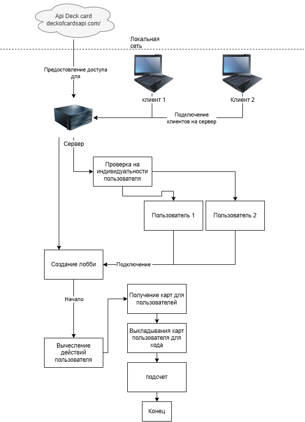

# Карточная игра «Дурак»
## Описание
Это командный проект по созданию игры "Дурак". Программа будет использовать графический интерфейс (Библиотека WinForms).  
  
Приложение - клиент-серверное  
  
Лобби создается с сервера; при создании лобби указывается количество ожидаемых игроков(пока всего два человека).  
"Лобби" уничтожается после завершения игры  
  
При запуске клиента пользователь видит экран с textbox, в который он должен ввести свой ник.  
После ввода ника игрок видит экран ожидания (других игроков).  
Как только все игроки присоединяются, начинается игра. (см фото)  

  
Пользователь видит свои карты в нижней части экрана.  
В верхней части экрана написано, сколько карт у противника.  
Слева написано, сколько карт в колоде и какой козырь.  
В центре экрана "поле боя" - какие карты бьют и кроют.  
  
(на данный момент можно крыть и выкидывать только одну карту за ход)  
*Карты являются кнопками на экране*  

_Ход игрока:_  
Игрок нажимает на карту(кнопку) и она появляется на "столе"  
  
_Ход противника:_  
Игрок нажимает на карту, которой хочет покрыться/нажимает на кнопку взятия карты.  
*проверка: можно ли крыть этой картой?*  
  
При завершении хода сервер выдает каждому игроку по карте.  
  
Условия победы: В колоде не осталось карт. У одного из игроков не осталось карт. Лобби закрывается.  
  
# Список с задачами
## Приоритет
Основная - 😀  
Вторичные - 👽  
Дополнительные - 👿  

|№|Задачи|Приоритет|
|-|-|-|
|1|~Сделать сервер~|😀|
|2|Колода, взаимодействие с колодой|😀|
|3|Интерфейс у клиента|👽|
|4|~Получение и хранение карт от сервера~|😀|
|5|Добавить отображение карт у клиентов|👽|
|6|Отправка запросов(данных) на сервер о использовании карты|😀|
|7|Обработка использования карт на стороне клиента(выброс карты из колоды)|👽|
|8|Создание лобби/комнаты с стороны сервера|👽|
|9|~Подключение клиента на комнату~|😀|
|10|Реализация ников |👿|
|11|~Cоставление UML-схем~|👿|

[API](https://deckofcardsapi.com/) для работы с картами (ЗАХОДИТЬ С ВПН)
 
 
 

# 1-й спринт
## 08.02.2026
@troxika - 😋  
@blqdema1l - 🤡  
@CheeseSpel - 👁️‍🗨️  
@SummerCat52 Seliss - 🤬  
@Ging4rBr4ad - 👾  

|№|Задачи|Исполнитель|
|-|-|-|
|1|Сделать сервер||
|2|Колода, взаимодействие с колодой|😋|
|4|Получение и хранение карт от сервера|🤬|
|9|Подключение клиента на комнату|🤡|

## Результаты 1-го спринта
🤬 

 
Папка CardsReceive
 
 
 

🤡 

 
Папка client.cs
 
 
 
😋 

 
 
 
 

# 2-й спринт
## 10.02.2026
@troxika - 😋  
@blqdema1l - 🤡  
@CheeseSpel - 👁️‍🗨️  
@SummerCat52 Seliss - 🤬  
@Ging4rBr4ad - 👾  

|№|Задачи|Исполнитель|
|-|-|-|
|2|Колода, взаимодействие с колодой|😋|
|6|Отправка запросов(данных) на сервер о использовании карты|🤡|
|11|Cоставление UML-схем|👁️‍🗨️|
|7|Обработка использования карт на стороне клиента(выброс карты из колоды)|👾|

## Результаты 2-го спринта
@troxika - 😋  
@blqdema1l - 🤡  
@CheeseSpel - 👁️‍🗨️  
@SummerCat52 Seliss - 🤬  
@Ging4rBr4ad - 👾  

👁️‍🗨️  

 
 
 

 
 
 

🤡 

 
client.cs
 
 
 
 
client.cs
 
 

# 3-й спринт
## 12.02.2026
@troxika - 😋  
@blqdema1l - 🤡  
@CheeseSpel - 👁️‍🗨️  
@SummerCat52 Seliss - 🤬  
@Ging4rBr4ad - 👾  

|№|Задачи|Исполнитель|
|-|-|-|
|2|Колода, взаимодействие с колодой|😋,👾|
|6|Отправка запросов(данных) на сервер о использовании карты|🤡,🤬|
|11|Cоставление UML-схем|👁️‍🗨️|

## Результаты 3-го спринта

👁️‍🗨️  
Сделан UML диаграмма классов программы Server.cs и переделан схема плана программы
.png)

